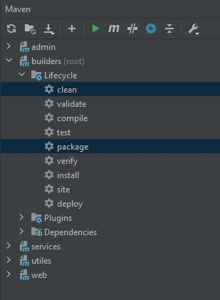

# Builders project

It's multi module project

### How to build this project
1. Open CMD or PowerShell, and execute following command: 
        cd path/builders
   
2. Execute maven command to build all projects:  
        mvn clean package
   
### Execute test
1. For start all tests you must be in root of project `.../builders` 
   and execute following command:  
        mvn test   

#### In idea

If you use intellij idea, you have button "Maven" at right part of window  
press on this button and you will see menu where you can choose  
"builders (root) -> Lifecycle -> choose here command and press button  
'run maven buld'"

